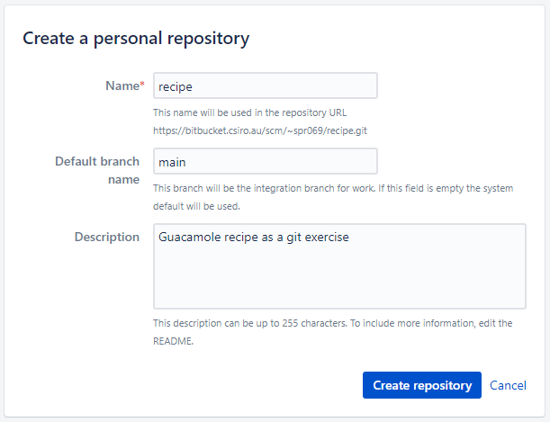

:::::::::::::::::::::::::::::::::::::: questions 

- How can I set up a public repository online?
- How can I clone a public repository to my computer?

::::::::::::::::::::::::::::::::::::::::::::::::

::::::::::::::::::::::::::::::::::::: objectives

- To get a feeling for remote repositories. 
- Learn how to publish a repository on the web.
- Learn how to fetch and track a repository from the web.

::::::::::::::::::::::::::::::::::::::::::::::::

In this episode, we will publish our guacamole recipe on the web. Don't worry, you will be able
to remove it afterwards.


## From our laptops to the web

We have seen that **creating Git repositories and moving them around is
simple** and that is great.

So far everything was local and all snapshots are saved under `.git`.

If we remove `.git`, we remove all Git history of a project.

But...
- What if the hard disk fails?
- What if somebody steals my laptop?
- How can we collaborate with others across the web?

---

## Remotes

To store your git data on another computer, you use **remotes**.  A
remote is like making another copy of your repository, but you can choose to only
**push** the changes you want to the remote and **pull** the changes you need
from the remote.

You might use remotes to:
- Back up your own work.
- To collaborate with other people.

There are different types of remotes:
- [GitHub](https://github.com) is a popular, closed-source commercial site.
- [GitLab](https://about.gitlab.com) is a popular, open-core
  commercial site.  Many universities have their own private GitLab servers
  set up.
- [Bitbucket](https://bitbucket.org) is yet another popular commercial site.

---

## Bitbucket

CSIRO has an enterprise bitbucket server [bitbucket.csiro.au](bitbucket.csiro.au) 
available for staff use. It offers a nice HTML user interface to browse the repositories 
and handles many things very nicely. Accounts use your CSIRO credentials. 

---

## Create a new repository on Bitbucket

1. Login at [bitbucket.csiro.au](bitbucket.csiro.au) 
2. Click on your user profile icon, in the top-right corner, then "View Profile"
3. Click "Create Repository"

On this page choose a repository name and description (screenshot).

{alt='Create new repo on bitbucket'}  
  
After you then click "Create repository", you will see a page similar to:

{alt='Bitbucket repo setup page'}  
  
Note that this screen is telling us exactly what to do to get started depending on different scenarios:
1. If creating the Bitbucket repository was the very first thing we'd done, before starting work (great
forward planning!) then we could **clone** the *empty* repository and start working in it. 
2. If we'd started working on files, but had never run `git init` and started performing local git 
opertaions, then it tells us how to now start tracking those files. However, it also then tells us how 
to link to this online repository, adding it's url as the "remote origin", through `git remote add`. 
**This is where we are.** 
3. The final scenario would be less used. It's only for when a repository had already been linked to a remote
but now you'd like change it to point this new one instead.  
  
Creating the repository on Bitbucket effectively did the equivalent to this on the Bitbucket servers:  

```bash
$ mkdir recipe 
$ cd recipe
$ git init
```


## Linking our local repository to Bitbucket

To be able to send our local changes to Bitbucket, we need to tell the local repository that the one we just 
created on Bitbucket's servers exists. To do this, we add a 'remote'. Git repositories can have any number of 
remotes, although it is by far the most common to only use one. Each git remote is given a name so that it can 
be referred to easily. The default remote name is `origin`.

As noted above, Bitbucket has provided us the instructions for how to do this under the scenario:

> **My code is ready to be pushed**

1. Go back to your guacamole repository on your computer.
2. Check that you are in the right place with `git status`.
3. We'll copy and paste the instructed commands from Bitbucket, however, we've already run `git init` and
already committed files, so we can ignore the first several steps, so...
3. Copy and paste just the last two lines to the terminal and execute those, in my case (**you
  need to replace the "user" part and possibly also the repository name if you gave it a different one**):

```bash
$ git remote add origin https://bitbucket.csiro.au/scm/<user>/recipe.git
$ git push -u origin HEAD:main
```

You should now see something similar to:

```output
Counting objects: 4, done.
Delta compression using up to 4 threads.
Compressing objects: 100% (4/4), done.
Writing objects: 100% (4/4), 259.80 KiB | 0 bytes/s, done.
Total 4 (delta 0), reused 0 (delta 0)
To https://bitbucket.csiro.au/scm/user/recipe.git
 * [new branch]      main -> main
branch 'main' set up to track 'origin/main'.
```

**Refresh your Bitbucket project website and - taa-daa - your commits should now be
online!**

What just happened? **Think of publishing a repository as uploading the `.git` part online**.

When those two lines of code were run, two commands were given. The first was to add a reference to the 
Bitbucket repository, and call it `origin`.

The second was to **push** our local changes to that remote. That command was:

```
git push -u origin main
```

This is in the format:

```
git push -u <remote-name> <branch-name>
```

If you've got a simple repository with only one remote and one repository, you can simply run `git push`.

  
::::::::::::::::::::::::::::::::::::: challenge 
  
## Challenge 1

Make a change to your project and commit the changes locally. 

Push the changes to your BitBucket remote.

What information can you access about the commit you just made?

::::::::::::::::::::::::::::::::::::::::::::::::

## Getting changes from the remote

Of course we don't want information to only go one way - if the remote has changes to the project from a collaborator 
we need to get those onto our local machine. To do this, we're doing the opposite of a `push`, so it's helpfully 
called a `pull`.

::::::::::::::::::::::::::::::::::::: challenge 

## Challenge 2

Make a change to your repository using the Bitbucket web interface: 
1. Click on a file and then click 'Edit' (top right)
2. Write something new and then click 'Commit' (bottom left)
3. Fill in commit message (as if you were doing a `commit -m "something"`) and click 'Commit' again

Once you've made a change, use `git pull` in your terminal to get the changes onto your local machine.

Inspect the history with `git log`.

::::::::::::::::::::::::::::::::::::::::::::::::


Similar to `git push`, if you have multiple remotes and branches, you need to specify which you are referring 
to by using the format `git pull <origin-name> <branch-name>`, but for our purposes `git pull` is sufficient.

::::::::::::::::::::::::::::::::::::: keypoints 

- A repository can have one or multiple remotes
- A remote serves as a full backup of your work.
- `git push` sends local changes to the remote
- `git pull` gets remote changes onto your local machine.
- A remote allows other people to collaborate with you

::::::::::::::::::::::::::::::::::::::::::::::::

[r-markdown]: https://rmarkdown.rstudio.com/
