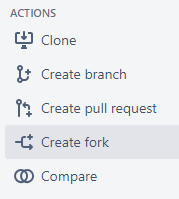
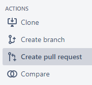
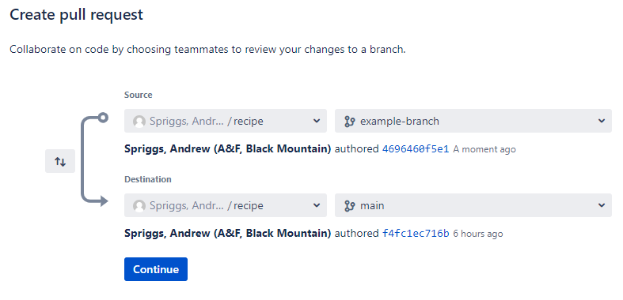
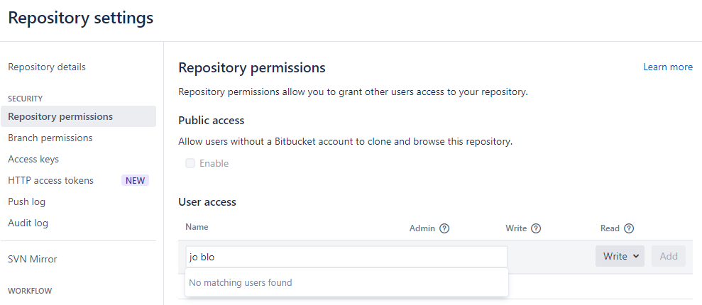

:::::::::::::::::::::::::::::::::::::: questions 

- How can I contribute to a shared repository?
- How can I contribute to a public repository without write access?

::::::::::::::::::::::::::::::::::::::::::::::::

::::::::::::::::::::::::::::::::::::: objectives

- Understand how to share a repository collaboratively.
- Learn how to contribute a pull request.

::::::::::::::::::::::::::::::::::::::::::::::::

## Collaborating with git remotes

One of the major advantages of version control systems is the ability to collaborate, without having to email each other files, or bother about sharedrives. We'll consider two scenarios for collaboration:

- A remote repository where collaborators each have write acess
- A remote repository where you do not have write access

## A remote with write access

Remember that a git remote is simply a copy of the `.git` directory. It contains the instructions for how to recreate any state in the history that has been captured. If more than one person is contributing to a collaborative remote, there will be a shared history. That is, the copy on the remote will be a combination of the history between the collaborators.

::::::::::::::::::::::::::::::::::::::::  discussion

## Discussion

What do you think will happen if two collaborators make their own sequence of commits on `main` and try to push them to the same remote?

::::::::::::::::::::::::::::::::::::::::::::::::::::

To make sure that you don't end up with a mess of conflicting commits, it's essential to have an agreed strategy for how to manage your contributions.

There are different models that can work, and depending on the complexity of each situation might be appropriate.

There's a good discussion of different models, including git-flow [here](https://www.gitkraken.com/learn/git/git-flow).

To be absolutely sure your local work won't conflict with someone else's, always work on your own branch. Don't commit directly to `main`, but only merge your branch onto `main` after discussion with your collaborators, or through a pull request (discussed below).

## A remote without write access

Lots of open source projects welcome contributions from the community, but clearly don't want to give write access to just anyone. Instead, a very commonly used approach is to accept pull requests from _forked_ versions of the repository.

### Forking a repo
Forking a repository is making your own copy of a remote. For example, a Data School example repo is hosted at 
`bitbucket.csiro.au/scm/dat/programmatic-data-example`. By forking that repository, you can have your own copy, retaining 
the complete history of the project, at `bitbucket.csiro.au/scm/<your_username>/programmatic-data-example`.  

To fork a repository on Bitbucket, click on the **Create Fork** button in the lefthand menu of a repository's page.  

{alt='Bitbucket repo fork'}

### Submitting a pull request

To contribute a change to a repository that you don't have write access to, you first of all need to make your own copy (fork the repo) which you do have write access to.
You can then make your changes to the repo, and push them to your own fork.

To get them into the original repo (if that's what you want), you need to ask the maintainers of that repository to accept them, through a _pull request_.
You are requesting that the repository "pull" in your changes. 

### Pull requests as a collaborative framework

Pull requests can also be useful on a repository that you *do* have write permissions on, as a collaborative,
organisational, and record-keeping tool. A common working pattern, when using Git in a team, is to complete a
body of work on a separate branch and then, rather than doing a `git merge`, instead create a pull request. 
In doing so, you can:
* Invite collaborators to review your changes
* Create discussion around the changes (with discussions saved for posterity)
* Continue to make further edits to your changes before finally merging
* Save a formalised record of these steps having taken place  
  
An open pull request may continue to receive further commits, by pushing changes to the same branch. 
This allows a pull request to act as a draft step, under review, until finally approved to 'merge'.  

---

## Pull requests on Bitbucket

The option to create a Pull request on Bitbucket may be found in the lefthand menu of a repository's page. 

{alt='bitbucket pull request menu'}

You'll then be asked to select a source branch (the branch with new work) and a target or destination branch
(the branch to `merge` into). 

{alt='bitbucket pull request menu'}

Next you'll be able to write a description of what the pull request is about, and request specific teammates 
as "reviewers" of the request, before confirming the pull request. 
  
With the pull request open, options include looking at the commits and file changes involved, writing discussion
comments, starting an official review, making edits, etc.. The final goal would usually be the 'Merge' button,
to the top-right, however other outcomes may be to decline or delete the pull request. 
  
---
  
::::::::::::::::::::::::::::::::::::: challenge 

## Challenge

Form teams of 2-3 people. One person will start.

Person 1:
1. One person from each team should create a new Bitbucket repository named 'favourite-things'.
2. Copy the supplied `git clone` command to create a local copy.
3. Locally, create a file named `README.md` and list a few of your favourite things within it.
4. Use `git add`, `git commit` and `git push` to move your new file back to the remote.
5. In the Bitbucket repository, click 'Repository Settings' in the lefthand menu, followed by 'Repository permissions'.  Use the form to give "User access" with "Write" permissions to your team member(s).   
6. Share the repository link to your team member(s).
 
 
**After** the above, other team member(s) then:
1. Use `git clone` to create a local copy of the 'favourite-things' repository.
2. Create and `switch` to a new branch (with a meaningful name).
3. Edit the `README.md` file to add a few of your own favourite things to it.
4. Use `git add`, `git commit` and `git push` to get your changes to the remote (still on your new branch).
5. On Bitbucket create a Pull Request that would merge your new branch into the original.
 
 
Finally, **together**, explore the created Pull Request(s) on Bitbucket and finally "merge" them. 
 
 
Bonus discussion: Why was the suggested filename 'README.md' specifically?  
 
::::::::::::::::::::::::::::::::::::::::::::::::

::::::::::::::::::::::::::::::::::::: keypoints 

- Sharing a repository needs good communication.
- Branches are _really_ necessary.
- Pull requests enable sensible merging of changes between branches and across repositories.

::::::::::::::::::::::::::::::::::::::::::::::::

[r-markdown]: https://rmarkdown.rstudio.com/
